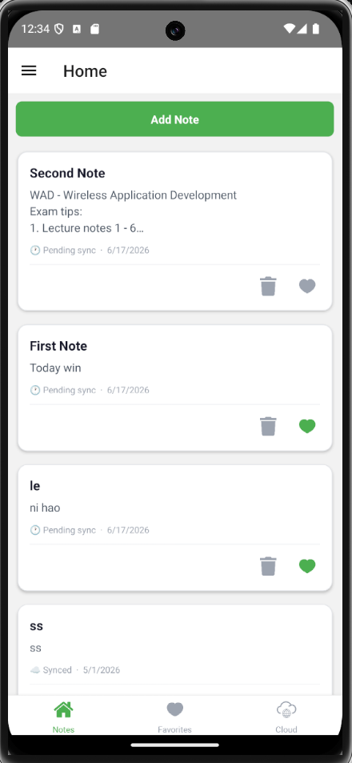
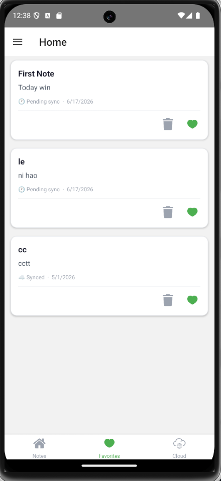
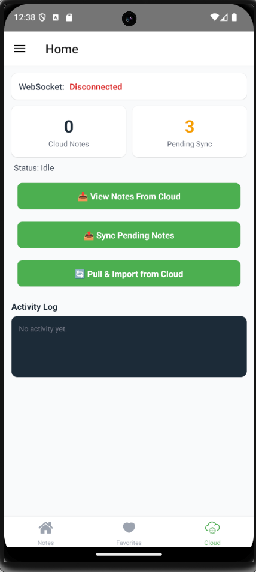
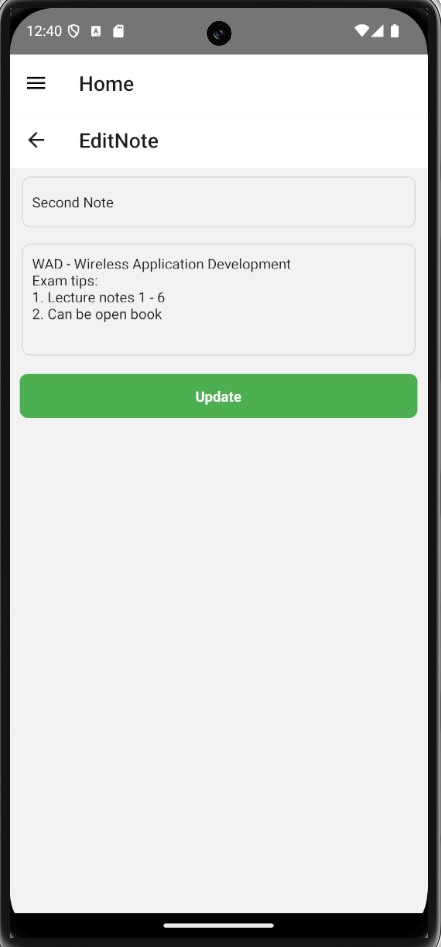
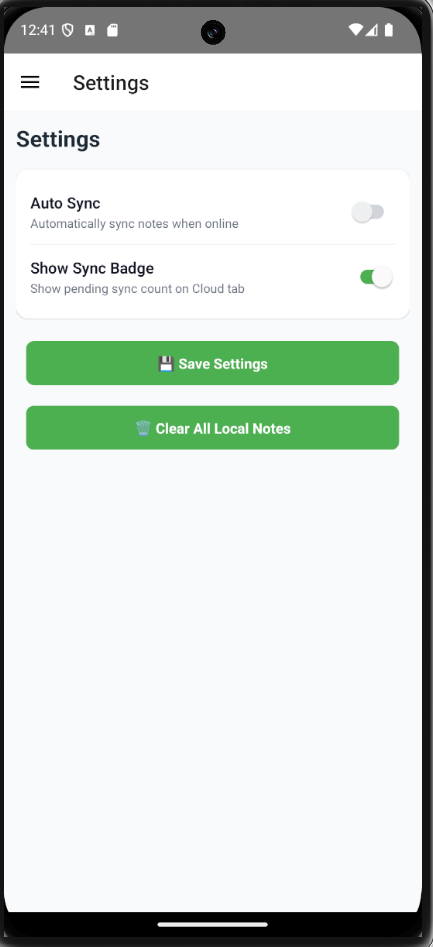
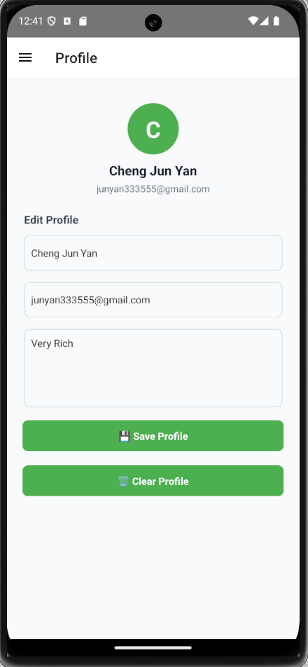

# Note-Taking-App
<div align="center">

# 📝 NoteApp

**A full-stack React Native note-taking app with cloud sync, favourites, and real-time WebSocket support.**


</div>

---

## 📖 Table of Contents

- [Introduction](#-introduction)
- [Screenshots](#-screenshots)
- [Features](#-features)
- [Tech Stack](#-tech-stack)
- [Project Structure](#-project-structure)
- [Prerequisites](#-prerequisites)
- [Setup & Installation](#-setup--installation)
- [Running the App](#-running-the-app)
- [API Reference](#-api-reference)
- [.gitignore Guide](#-gitignore-guide)

---

## 🌟 Introduction

**NoteApp** is a mobile application built with **React Native (TypeScript)** that lets users create, edit, organise, and sync notes to a cloud server. Notes are stored locally using **AsyncStorage** for offline access, and can be pushed to or pulled from a **Node.js + SQLite** REST API backend. Real-time server messages are delivered via **Socket.IO WebSocket** connection.

The app features a clean multi-level navigation structure (Drawer → Stack → Tab), and allows users to mark notes as favourites and manage their profile and settings — all persisted locally.

---

## 📱 Screenshots
| Home Screen | Favourites | Cloud Sync |
|:-----------:|:----------:|:----------:|
|  |  |  |

| Edit Note | Settings | Profile |
|:--------:|:---------:|:--------:|
|  |  |   |

---

## ✨ Features

### 📋 Note Management
- ✅ **Create** notes with a title and content (max 80 characters for title)
- ✅ **Edit** notes by tapping anywhere on the note card
- ✅ **Delete** notes with a confirmation dialog to prevent accidental deletion
- ✅ **Favourite / Unfavourite** notes with a heart icon (grey → green toggle)

### ☁️ Cloud Sync
- ✅ **Push** pending local notes to the cloud server (POST)
- ✅ **Pull** notes from the cloud for preview (GET)
- ✅ **Pull & Import** — fetch cloud notes and merge them into local storage
- ✅ **Real-time WebSocket** activity log via Socket.IO
- ✅ **Sync status badges** — shows pending, synced, or failed per note

### 🧭 Navigation
- ✅ **Drawer Navigator** — Home, Profile, Settings
- ✅ **Bottom Tab Navigator** — Notes, Favourites, Cloud
- ✅ **Stack Navigator** — Add Note, Edit Note screens

### 👤 Profile & Settings
- ✅ **Profile screen** — save name, email, bio with AsyncStorage
- ✅ **Settings screen** — toggle Auto Sync and Show Sync Badge
- ✅ **Auto Sync** — automatically syncs pending notes when visiting Cloud tab

### 🎨 UI / UX
- ✅ Heart icon turns **green** when a note is favourited, **grey** when not
- ✅ Trash icon triggers a **confirmation alert** before deleting
- ✅ Sync status shown on each note card (pending / synced / failed)
- ✅ WebSocket connection status displayed live on Cloud screen

---

## 🛠 Tech Stack

| Layer | Technology |
|-------|------------|
| Mobile Framework | React Native (TypeScript) |
| Local Storage | AsyncStorage |
| Navigation | React Navigation (Drawer + Stack + Tab) |
| HTTP Client | Axios |
| Real-time | Socket.IO Client |
| Backend | Node.js + Express |
| Database | SQLite (via `sqlite3`) |
| WebSocket Server | Socket.IO |

---

## 📁 Project Structure

```
NoteAppAssignment/
├── App.tsx                   # App entry point
├── server.js                 # Express REST API + Socket.IO server
├── notes_server.sqlite       # SQLite database (auto-created)
│
├── assets/
│   ├── home.png
│   ├── heart.png
│   └── cloud.png
│
├── components/
│   ├── CustomButton.tsx
│   ├── CustomInput.tsx
│   └── NoteCard.tsx          # Note card with heart & trash icons
│
├── navigation/
│   ├── AppNavigator.tsx
│   ├── DrawerNavigator.tsx
│   ├── StackNavigator.tsx
│   └── TabNavigator.tsx
│
├── screens/
│   ├── HomeScreen.tsx
│   ├── FavoritesScreen.tsx
│   ├── CloudSyncScreen.tsx
│   ├── AddNoteScreen.tsx
│   ├── EditNoteScreen.tsx
│   ├── ProfileScreen.tsx
│   └── SettingsScreen.tsx
│
├── services/
│   └── api.ts                # REST API + WebSocket (createSocket)
│
├── storage/
│   └── noteStorage.ts        # AsyncStorage CRUD helpers
│
└── types/
    └── Note.ts               # Note & SyncStatus types
```

---

## 📋 Prerequisites

Make sure you have the following installed before continuing:

- [Node.js](https://nodejs.org/) v18 or above
- [npm](https://www.npmjs.com/) or [yarn](https://yarnpkg.com/)
- [React Native CLI](https://reactnative.dev/docs/environment-setup)
- [Android Studio](https://developer.android.com/studio) with an emulator set up
- Java Development Kit (JDK) 17

---

## 🚀 Setup & Installation

### 1. Clone the Repository

```bash
git clone https://github.com/YOUR_USERNAME/NoteAppAssignment.git
```

```bash
cd NoteAppAssignment
```

### 2. Install Mobile App Dependencies

```bash
npm install
```

### 3. Install Server Dependencies

The backend uses Express, SQLite, and Socket.IO:

```bash
npm install express sqlite3 cors socket.io
```

### 4. Install Axios (HTTP client for the app)

```bash
npm install axios
```

### 5. Install Socket.IO Client (for the app)

```bash
npm install --save socket.io-client --force
```

---

## ▶️ Running the App

### Step 1 — Start the Backend Server

Open a **new terminal** and run:

```bash
node server.js
```

You should see:

```
Database connected.
Server running on port 5000
REST API : http://localhost:5000/api/notes
Emulator : http://10.0.2.2:5000/api/notes
```

> ⚠️ Keep this terminal running while using the app. The Android emulator uses `10.0.2.2` to reach your machine's `localhost`.

---

### Step 2 — Start Metro Bundler

Open a **second terminal** in your project folder:

```bash
npx react-native start
```

---

### Step 3 — Run on Android Emulator

Open a **third terminal** in your project folder:

```bash
npx react-native run-android
```

> 💡 Make sure your Android emulator is already running in Android Studio before executing this command.

---

## 🔌 API Reference

The backend exposes the following REST endpoints on `http://localhost:5000`:

| Method | Endpoint | Description |
|--------|----------|-------------|
| `GET` | `/api/notes` | Fetch all notes |
| `GET` | `/api/notes/:id` | Fetch a single note by ID |
| `POST` | `/api/notes` | Create or replace a note |
| `PUT` | `/api/notes/:id` | Update an existing note |
| `DELETE` | `/api/notes/:id` | Delete a note |

### WebSocket (Socket.IO)

- **Namespace:** `/notes`
- **Client → Server events:** `client_connected`, `client_send`
- **Server → Client events:** `server_send`

---

## 🚫 .gitignore Guide

Yes — you **should** set up a `.gitignore` before pushing to GitHub. Without it, you will accidentally push large auto-generated folders like `node_modules/` (can be 300MB+), build outputs, and system files.

### How to Set It Up

Create a file called `.gitignore` in your **project root** (`NoteAppAssignment/`) and paste the following:

```gitignore
# ─── Node ────────────────────────────────────────────
node_modules/
npm-debug.log
yarn-error.log
yarn-debug.log

# ─── React Native ────────────────────────────────────
# Android build outputs
android/app/build/
android/.gradle/
android/local.properties

# iOS build outputs
ios/build/
ios/Pods/
ios/*.xcworkspace
*.pbxuser
*.mode1v3
*.mode2v3
*.perspectivev3
!default.pbxuser
!default.mode1v3
!default.mode2v3
!default.perspectivev3

# Metro bundler cache
.metro-health-check*

# React Native generated
.bundle/

# ─── Environment & Secrets ───────────────────────────
.env
.env.local
.env.production

# ─── Database ────────────────────────────────────────
# Comment out the line below if you WANT to include the SQLite DB
notes_server.sqlite

# ─── OS / Editor ─────────────────────────────────────
.DS_Store
Thumbs.db
.vscode/
.idea/

# ─── Logs ────────────────────────────────────────────
*.log
logs/
```

### What Each Section Does

| Section | Why ignore it? |
|---------|---------------|
| `node_modules/` | Auto-installed by `npm install` — never commit this (huge, reproducible) |
| `android/app/build/` | Compiled Android output — regenerated on every build |
| `ios/Pods/` | CocoaPods dependencies — regenerated by `pod install` |
| `.env` | Contains secrets/API keys — never commit these |
| `notes_server.sqlite` | Local database file — other developers will generate their own |
| `.DS_Store` | macOS system file — not relevant to the project |

> 💡 **Tip:** If you already committed `node_modules/` by mistake, run:
> ```bash
> git rm -r --cached node_modules
> ```
> ```bash
> git commit -m "Remove node_modules from tracking"
> ```

---

<div align="center">

Made with using React Native

</div>
